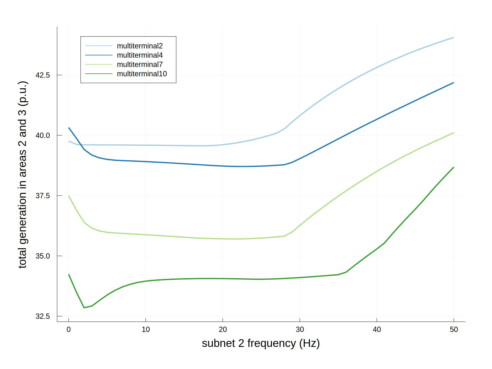
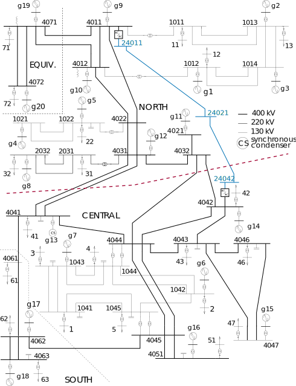
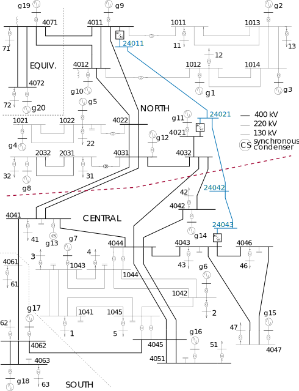
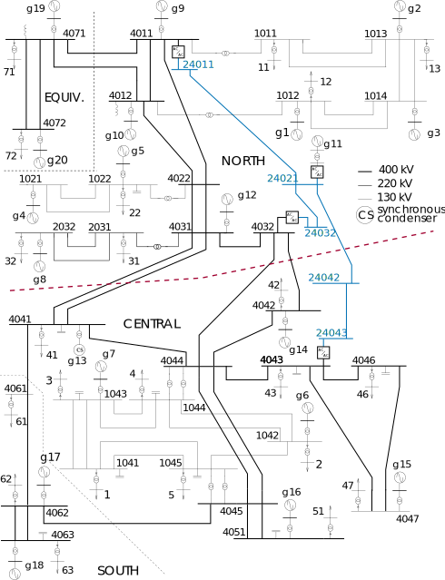
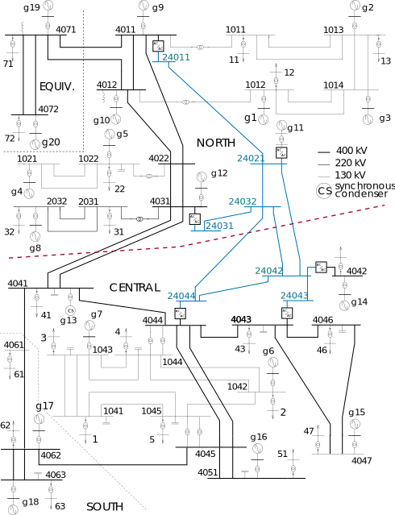

### Analyze the frequency dependence of performance under different upgrades
Here we consider multi-terminal upgrades in the Nordic system, consisting of a corridor or meshed collection of lines upgraded to a low frequency AC subnetwork. We consider three such upgrades, represented with the data in the folders `multiterminal2`, `multiterminal4`, `multiterminal7`, and `multiterminal10` in `test/data/nordic_fault_multiterminal`. For each upgrade, we solve the OPF with a fixed LFAC subnetwork frequency and repeat over a range of frequencies, saving the resulting quantities as series versus the LFAC frequency. For this, we use `frequency_ranges`. The `fmin` and `fmax` arguments allow us to specify a range of frequencies for each step if their values are different. Here, we keep the frequency fixed at each step by making them equal, and we use a step size of 1 Hz. The multi-terminal upgrades used in this example are shown as network diagrams below.

```julia
using VariableFrequencyOPF

base_folder = "test/data/nordic_fault_multiterminal"
folders = [
    "multiterminal2",
    "multiterminal4",
    "multiterminal7",
    "multiterminal10"
]
fmin = 0:1:50
fmax = 0:1:50
lfac_subnet = 2
results_dicts = Array{Dict}(undef, length(folders))
output_plots = Array{Any}(undef, length(folders))
for (i,f) in enumerate(folders)
    (results_dicts[i], output_plots[i]) = VariableFrequencyOPF.frequency_ranges(
        fmin,
        fmax,
        lfac_subnet,
        base_folder*"/$f/",
        "areagen",
        [("frequency (Hz)",2)],
        [];
        gen_areas=[2,3],
        area_transfer=[1,2],
        no_converter_loss=true
    )
end
```

This plots the results versus frequency for each upgrade. To plot all upgrades together, we use the results dictionaries we've saved and plot the values with `plot_results_dict_line`.

```julia
subnet_arr = results_dicts[1]["subnet"][1]

x_axis = ("frequency (Hz)", 2)
output_folder = "results/nordic_fault_multiterminal/sweep_comparison/"
vert_line = ([],"")
horiz_line = ([],"")
xlimits = []
ylimits = []
output_plot_label = ("","")
series_labels = folders
# plot the results
VariableFrequencyOPF.plot_results_dict_line(
    results_dicts,
    subnet_arr,
    x_axis,
    output_folder,
    vert_line,
    horiz_line,
    xlimits,
    ylimits,
    output_plot_label,
    series_labels=series_labels,
    plot_infeasible_boundaries=false,
    color_palette=:Paired_12
)
```

One resulting plot shows the objective value, generation in the Central and South areas, versus the LFAC frequency for all four upgrades:


The multi-terminal upgrades used in this example are the following:

| [](examples/fig/nordicsystem_mt2line_2interface.svg) | [](examples/fig/nordicsystem_mt2line_ext_3interface.svg) | [](examples/fig/nordicsystem_mt3line_ext_4interface.svg) | [](examples/fig/nordicsystem_mt7line.svg) |
|:--:|:--:|:--:|:--:|
| *Multiterminal upgrade 2* | *Multiterminal upgrade 4* | *Multiterminal upgrade 7* | *Multiterminal upgrade 10* |
