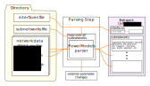
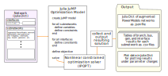

```@meta
CurrentModule = VariableFrequencyOPF
```

# VariableFrequencyOPF
## Description
AC optimal power flow for networks with multiple frequencies, with each frequency as an optimization variable.

One main goal of this package is a flexible and extensible implementation which can fully accommodate the multiple and variable frequency OPF formulation with power flow control between frequency areas. This package allows additional modifications to the constraints and objective function as the analysis develops.

Another goal is a smooth extension of existing data formats to the case of multiple and variable frequencies. To this end, it is important that the software can import industry standard steady state network modeling formats with the minimum necessary additional specification of the parameters which are new to this framework.
## Usage
Add this package with the following command in the Julia REPL:

    ] add git@github.com:WISPO-POP/VariableFrequencyOPF.jl.git

Load the package:

    using VariableFrequencyOPF

You can also run the package tests:

    ] test VariableFrequencyOPF

### Parsing Network Data

#### Input data
Each frequency area, or subnetwork, is described by a network data file in a standard format, including PSS&reg;E *.raw* files, Matpower *.m* files, or PowerModels dictionaries saved in formats such as *.json*.

The file *subnetworks.csv* contains the names of the network data files for each subnetwork, in the order in which they are to be parsed, and the subnetwork-wide frequency parameters, including a boolean specification of whether the frequency is variable, the base frequency at which the impedance parameters in the network file are defined, and the range of allowed frequencies. An example *subnetworks.csv* is shown here:

| index | file            | variable_f | f_base | f_min | f_max |
|-------|-----------------|------------|--------|-------|-------|
| 1     | base_subnet.raw | false      | 60     | 60    | 60    |
| 2     | lfac_subnet.raw | true       | 60     | 10    | 50    |

The file *interfaces.csv* specifies all the connections between different subnetworks. Each interface is given a unique integer index, and each row in the file which has this interface index specifies a connection to the interface. The rows specify the subnetwork and bus, along with any additional parameters, including the maximum apparent power in per unit. An example *interfaces.csv* file is shown below.

| index | subnet_index | bus  | s_max |
|-------|--------------|------|-------|
| 1     | 1            | 1011 | 10.0  |
| 2     | 1            | 1013 | 10.0  |
| 1     | 2            | 1    | 10.0  |
| 2     | 2            | 2    | 10.0  |

This example shows two interfaces. The first connects bus 1011 in subnetwork 1 to bus 1 in subnetwork 2, and the second connects bus 1013 in subnetwork 1 to bus 2 in subnetwork 2. The apparent power limit at each interface connection is 10.0 p.u.

### Modeling and Solving the OPF


## Examples
### Run the OPF for a set of upgrades
We want to define a set of upgrades in the Nordic system, each consisting of a single point-to-point upgrade. We use the function `enumerate_branches` to create the network data for each upgraded case. This generates a folder of network data for the single network file `base_network` with one line converted to LFAC, once for each index in `indices`, or if `indices` is empty, for every non-transformer branch in the network. Once we have created the data for each of these upgrades, we can call `run_series` to solve the OPF for each upgrade.

```julia
using VariableFrequencyOPF

original_network = "test/data/nordic_fault/base/fault_4032_4044.m"
# We choose to put the new network data in the same folder because
# we also want to use some data that is already there. Each upgrade
# gets its own folder.
new_data_directory = "test/data/nordic_fault/"
standard_frequency = 50.0
lfac_branch_upgrades = [21,27,28,29,30,31,32,33]

VariableFrequencyOPF.upgrade_branches(
    original_network,
    new_data_directory,
    standard_frequency,
    indices=lfac_branch_upgrades
)

# Minimize generation in areas 2 and 3 with plots including
# the power flow between areas 1 and 2
objective = "areagen"
gen_areas = [2,3]
area_transfer = [1,2]
# We want to plot the results of all branch upgrades,
# so we set `enum_branch` to true
enum_branches = true

solution =  VariableFrequencyOPF.run_series(
    new_data_directory,
    objective;
    gen_areas=gen_areas,
    area_transfer=area_transfer,
    enum_branches=enum_branches
)
results_dict = solution[1]
n_subnets = solution[2]
subnet_array = solution[3]
idx_sorted = solution[4]
series_output_folder = solution[5]
plot_best_x = solution[6]

println("Ran the OPF for all folders and saved the outputs in $series_output_folder.")

# Now we generate plots showing the results across all the upgrades.
# We could plot multiple series (e.g. with different operating conditions,
# converter parameters, etc.) on the same x axis by adding them
# to the following array. Here we only plot one.
results_dict_allplots = [results_dict]

plot_output_folder = "results/nordic_fault/"
series_labels = ["LFAC upgrades"]

VariableFrequencyOPF.plot_results_dicts_bar(
    results_dict_allplots,
    n_subnets,
    subnet_array,
    idx_sorted,
    plot_output_folder,
    plot_best_x,
    series_labels,
    color_palette=:Dark2_8
)
```
The function `run_series` solves the OPF for each upgrade and generates results in *.csv* files. The next function, `plot_results_dicts_bar`, generates and saves plots of certain variables. For example, we can look at the plot of the objective value, *total generation in areas 2 and 3 (p.u.)*:


## Index
```@index
```
## Functions
```@autodocs
Modules = [VariableFrequencyOPF]
```
