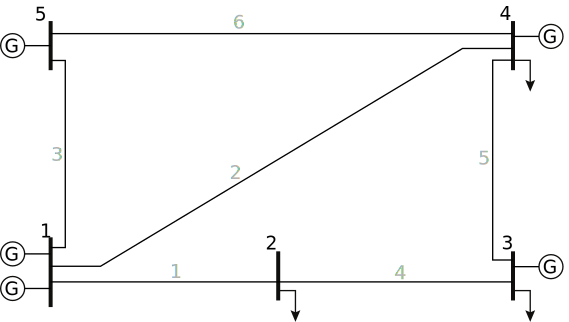

### Example workflow for a low frequency AC upgrade
#### Solving the OPF without upgrades
We begin by solving the optimal power flow for a network with a single, fixed frequency. Consider the 5 bus network shown here:



It is represented in a MATPOWER case file: [case5.m](https://github.com/WISPO-POP/VariableFrequencyOPF.jl/test/data/case5/base/case5.m)

For this example, we put this file in a folder called `base` inside a parent folder `case5` for all the cases we'll consider here. This will be the base network without any upgrades.

Because the functions in this package expect networks which may have variable frequency portions, we need to specify some details about frequency. This is done by creating a file in the same folder, called `subnetworks.csv`. This file must specify the name of the network data file, whether it is a variable frequency network, and at what frequency all the parameters in the network data file are defined. If the frequency is variable, it also must specify the upper and lower limits of the frequency.

| index | file            | variable_f | f_base | f_min | f_max |
|-------|-----------------|------------|--------|-------|-------|
| 1     | case5.m         | false      | 60     |       |       |

Now we can solve the standard AC OPF for this network, with the objective of minimizing cost:

```julia
using VariableFrequencyOPF

data_folder = "test/data/case5/base/"
objective = "mincost"

solution = VariableFrequencyOPF.multifrequency_opf(data_folder, objective)

# The first element in the solution output is a dictionary containing several important results.
results_dict = solution[1]
println(results_dict)
```
The output looks like this. The result values are in arrays, where each element corresponds to a subnetwork. We only have one subnetwork here.
```julia
Dict{String,Any} with 11 entries:
  "frequency (Hz)" => [60.0]
  "total loss"     => [0.0519209]
  "converter loss" => [0.0]
  "status"         => LOCALLY_SOLVED
  "CPU time (s)"   => 0.826
  "iterations"     => 28
  "total time (s)" => 0.860499
  "subnet"         => [1]
  "cost"           => [17551.9]
  "generation"     => [10.0519]
  "line loss"      => [0.051921]
```

#### Upgrading a line to low frequency AC
Now we would like to upgrade one line to low frequency AC (LFAC) and solve the OPF with frequency as a variable. An upgrade of line 2 will make this line into its own variable frequency subnetwork, like this:


To present this data to VariableFrequencyOPF, we need to create a new network file for the subnetwork, modify the original, add a line to `subnetworks.csv` and specify some details about how the subnetworks connect through another file, `interfaces.csv`.

The function `upgrade_branches` takes care of all of these steps for us.

```julia
base_network = "test/data/case5/base/case5.m"
output_location = "test/data/case5/"
base_frequency = 60.0
branches_to_upgrade = [2]
# We neglect converter losses in this example
noloss = true

VariableFrequencyOPF.upgrade_branches(
    base_network,
    output_location,
    base_frequency
    indices=branches_to_upgrade,
    noloss=noloss
)
```
This creates a new folder inside `case5` called `br2`. In this folder, we have `case5.m` with line 2 removed and a new network file, `lfac_case5.m`, which has two LFAC buses and the line which was formerly line 2 between them. We also have `subnetworks.csv` with a new row:

| index | file            | variable_f | f_base | f_min | f_max |
|-------|-----------------|------------|--------|-------|-------|
| 1     | case5.m         | false      | 60     |       |       |
| 2     | lfac_case5.m    | true       | 60     | 0.1   | 100   |

This allows the frequency to vary between 0.1 and 100 Hz in the LFAC subnetwork.

We also have a new file, `interaces.csv`, specifying some details of the connections between the subnetworks. We set the converter losses to zero in this example, but we could specify any of these parameter values to model our converters and any filter or transformer branches connected to it. We can also specify the operating limits on current and voltage, respectively, of the converters with `imax` and `vmax`.

| index | subnet_index | bus | imax | vmax | c1 | c2 | c3 | sw1 | sw2 | sw3 | M   | smax | R        | X     | G | B      | transformer | tap | shift |
|-------|--------------|-----|------|------|----|----|----|-----|-----|-----|-----|------|----------|-------|---|--------|-------------|-----|-------|
| 1     | 1            | 1   | 40   | 1.1  | 0  | 0  | 0  | 0   | 0   | 0   | 0.9 | 50   | 1.00E-05 | 0.001 | 0 | 0.0001 | FALSE       | 1   | 0     |
| 2     | 1            | 4   | 40   | 1.1  | 0  | 0  | 0  | 0   | 0   | 0   | 0.9 | 50   | 1.00E-05 | 0.001 | 0 | 0.0001 | FALSE       | 1   | 0     |
| 1     | 2            | 1   | 40   | 1.1  | 0  | 0  | 0  | 0   | 0   | 0   | 0.9 | 50   | 1.00E-05 | 0.001 | 0 | 0.0001 | FALSE       | 1   | 0     |
| 2     | 2            | 2   | 40   | 1.1  | 0  | 0  | 0  | 0   | 0   | 0   | 0.9 | 50   | 1.00E-05 | 0.001 | 0 | 0.0001 | FALSE       | 1   | 0     |

Now we can solve the OPF for this network:
```julia
data_folder = "test/data/case5/br2/"
objective = "mincost"

solution = VariableFrequencyOPF.multifrequency_opf(data_folder, objective)

# The first element in the solution output is a dictionary containing several important results.
results_dict = solution[1]
println(results_dict)
```

### Solve the OPF for a network with a variable frequency (low frequency AC) portion
Consider a power system which is divided into two areas connected by AC-AC converters: one operates at a fixed frequency of 60 Hz, and the other is a multi-terminal low frequency AC network, whose frequency can be chosen. In the directory `test/data/case14_twoarea` is data for a modified IEEE 14 bus network which fits this paradigm, as drawn here, with the variable frequency portion in blue:


In this example, we solve the OPF for this case, and we print the termination status, generation cost and optimal frequencies (The frequency of the standard part of the network is fixed at 60 Hz, and the frequency of the other part is allowed to vary between 1.0 and 100.0 Hz).
```julia
using VariableFrequencyOPF

data_folder = "test/data/case14_twoarea/two_area/"
objective = "mincost"

solution = VariableFrequencyOPF.multifrequency_opf(data_folder, objective)

results_dict = solution[1]

# Print results
println("Status:")
println(results_dict["status"])
println("\nCost:\n==============================")
println("Variable frequency subnetwork:")
println(results_dict["cost"][1])
println("Fixed frequency subnetwork:")
println(results_dict["cost"][2])
println("\nFrequency:\n==============================")
println("Variable frequency subnetwork:")
println(results_dict["frequency (Hz)"][1])
println("Fixed frequency subnetwork:")
println(results_dict["frequency (Hz)"][2])
```
**output:**
```julia
Status:
LOCALLY_SOLVED

Cost:
==============================
Variable frequency subnetwork:
7565.237470495639
Fixed frequency subnetwork:
553.6125608844086

Frequency:
==============================
Variable frequency subnetwork:
1.0
Fixed frequency subnetwork:
60.0
```
