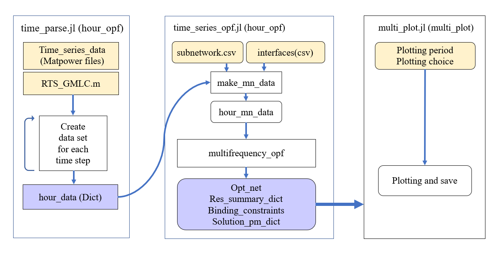
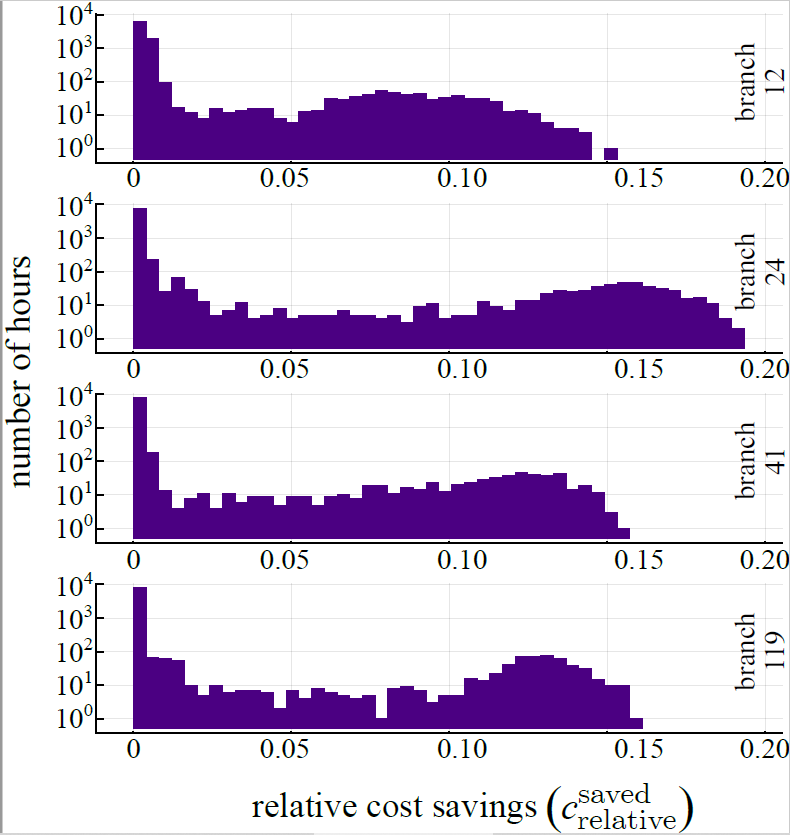

### time-series for Variable-Frequency OPF
#### Project description
The project is based on the Variablefrequency-opf project. In the project, we use the time-series data form the dataset of RTS_GMLC system.
(add the link)


In the project, we basically parse the RTS_GMLC data with the default RTS_GMLC network. (here I named the output dictionary “hour_data”). Each entry of the “hour_data” is a whole copy of the original RTS_GMLC dictionary combined with the time-series data at that specific time point. Then we generate the system of subnetworks (hour_mn_data) using make_mn_data. These networks are the data for optimization. We input each time step of hour_mn_data into multifrequency_opf by a for-loop and store the output in a similar structure as "hour_mn_data".

After we have the optimization results, the data can be plotted by using the function “multi_plot”, with flexibility on range of data and mode of plot.

#### Function description & Examples
##### 1. hour_parse:
```
hour_parse(month_st, day_st, period_st, month_en, day_en, period_en, folder)
```
This function uses the base network “RTS_GMLC.m”, the network file information (`subnetworks.csv` in 'folder') and the time-series data (in `folder`) to generate networks for optimization for a single case. This function is used in `hour_opf` function described below in this project, so it will not shown in the complete example at the end of this chapter.
###### Arguments:
- `month_st`: the month to start
- `day_st`: the day to start
- `period_st`: the hour to start
- `month_en`: the month that ends parsing
- `day_en`: the month that ends parsing
- `period_en`: the month that ends parsing
(here the periods need to be chosen corresponding to the data set use in the future)
- `folder`: the folder containing the time-sereis data and `subnetworks.csv` of one single case (For example I can set it to be `time_series/enum_net/br1`)

##### 2.1. hour_opf (hour_opf_modified):
```
function hour_opf(month_st, day_st, period_st, month_en, day_en, period_en,
      folder:: String,
      subnet_folder:: String,
      output_folder::String,
      obj::String,
      gen_areas = [],
      area_transfer = [],
      plot_results::Bool = true,
      print_results::Bool = false)
```
This function uses the similar structure of `multi-frequency-opf` with some additional arguments. Inside the function, we input each time step of hour_mn_data into multifrequency_opf by a for-loop and store the output in a similar data structure as hour_mn_data. The output data is then stored into `.json` file in the specified `output_folder`. The output files are of three types:
-`binding_constraints`: the cosntriants
-`opt_net`: optimal network result of that sub-network case during the specific time period
-`res_summary`: optimal network result of that sub-network case during the specific time period
The names are also specified to subnet numbers and periods. For exmaple,
```
res_summary_br10_(1.1.1__12.31.24).json
```
is the res_summary file for branch 10 optimized during the period of 1AM, Jan 1st to 12PM Dec 31st.

`hour_opf` is in default to run for the whole year period for the convinience when plot using function `multi_plot` specified below.

`hour_opf_modified` is of the same format regrading the input and output. It is only for testing purposes.

###### Arguments:
- `month_st, day_st, period_st, month_en, day_en, period_en`: the time points to specify tim periods for plotting
- `folder::String:`: the directory containing all subnetwork data, subnetworks.csv, interfaces.csv
- `subne_folder`: the number of subnet that is to be optimized (which directs to the sub-folder containing its data)
- `output_folder`: the folder specified to save the output files
- `plot_results::Bool = true`: choice of plot the optimization result (optimal value vs time points) directly after optimization, default false
Below are the similar arguments as `multifrequency-opf`:
- `obj::String`: the objective function to use, from the following:
   - "mincost": minimize generation cost
   - "areagen": minimize generation in the areas specified in `gen_areas`
   - "minredispatch": minimize the change in generator dispatch from the initial values defined in the network data
- `gen_areas`: integer array of all areas in which generation should be minimized if `obj=="mincost"`
- `area_transfer`: two areas with power transfer between them that should be saved and plotted. Results for P, Q, S, and loss are saved for power transfer between the two areas. Must have exactly two elements.
- `print_results::Bool`: if true, print the optimization results

###### Examples:
```
hour_opf(1, 1, 1, 1, 1, 3, "./time_series", "br10", "./time_series_out", "mincost", false, false)
```
This example runs optimization for 3 hours at the beginning of the year. The case is branch 10, the input files are from folder `./time_series` and output to `./time_series_out`. This is the same for `hour_opf_modified`


##### 2.2. hour_opf_regularized:
```
function hour_opf(month_st, day_st, period_st, month_en, day_en, period_en,
      folder:: String,
      subnet_folder:: String,
      output_folder::String,
      obj::String,
      gen_areas = [],
      area_transfer = [],
      plot_results::Bool = true,
      print_results::Bool = false
      regularize_f::Float64=0.0,
      ipopt_max_iter::Int64=20000)
```
Similar structure as `hour_opf`, but added 2 more arguments. This function is performing optimization with regularization on the optimal frequency. Larger the differences between the optimal frequency and 60 Hz (the original frequency), larger the penalty. Below are the additional arguments:

- `regularize_f`: the coefficient of regularizer.
- `ipopt_max_iter`: the amount of iterations of the server when solving each time point.

###### Examples:
```
hour_opf_regularized(1, 1, 1, 1, 1, 3, "./time_series", "br10", "./time_series_out", "mincost", false, false, 1e0, 20000)
```
This example runs optimization for 3 hours at the beginning of the year. The case is branch 10, the input files are from folder `./time_series` and output to `./time_series_out`. The regularizer is 1e0 and the maximum number of iterations of the solver is 20000.

##### 3. multi_plot (same for multi_plot_new):
```
function multi_plot(month_st, day_st, period_st, month_en, day_en, period_en, br_arr_raw, folder, output_folder,
      plot_choice::String = "single")
```
The function uses the period of plotting, the information of networks to plot (the output files from hour_opf or other data files of similar data structures) and choice of plotting. It is flexible on the types of plots, the range to plot and the data sets to investigate. Separate plot from the process of running the data can help to improve the efficiency. The input folder is the output folder of the `hour_opf`.

###### Arguments:
- `month_st, day_st, period_st, month_en, day_en, period_en`: the start and end time for the period of data to plot
- `br_arr_raw`: the array containg the indexex of subnets to plot (in format of `Int64`). If using the `single` for `plot_choice`, the function only reads in the first index of network if the choice is single.
- `folder`: the target folder containg the data files for plot (is the folder containing the output of the `hour_opf`)
- `output_folder`: the folder specified to save the output files
- `plot_choice::String = "single"`: default `single`,
   - "single": some plots of a single upgrade in a time period: optimal result & frequency of a network, improvements compared to the base case
   - "compare": comparisons of several upgrades on different aspects: average optimal cost; improvement rates; histogram of improvement rates

###### Examples:
```
multi_plot(8, 1, 1, 8, 15, 24, [12 24 41 119], "time_series_out", "time_series_out", "compare")
```
This plots the comparison of histogram of improvement rates of several upgrades.
The result plot is shown as below.



A complete example for the whole process from parse to optimize to plot is:
```
# Here I run the whole year data for default, then I have all the data and don't need to run it for other periods in the future
hour_opf(1, 1, 1, 12, 31, 24, "./time_series", "br10", "./time_series_out", "mincost", false, false)     

# In this function I set the input folder of multi_plot to be the output folder of the hour_opf.
# The specified time period is 8.1.1 - 8.15.24 and the subnetx number is 10.
multi_plot(8, 1, 1, 8, 15, 24, [10], "time_series_out", "time_series_out", "single")                     
```
